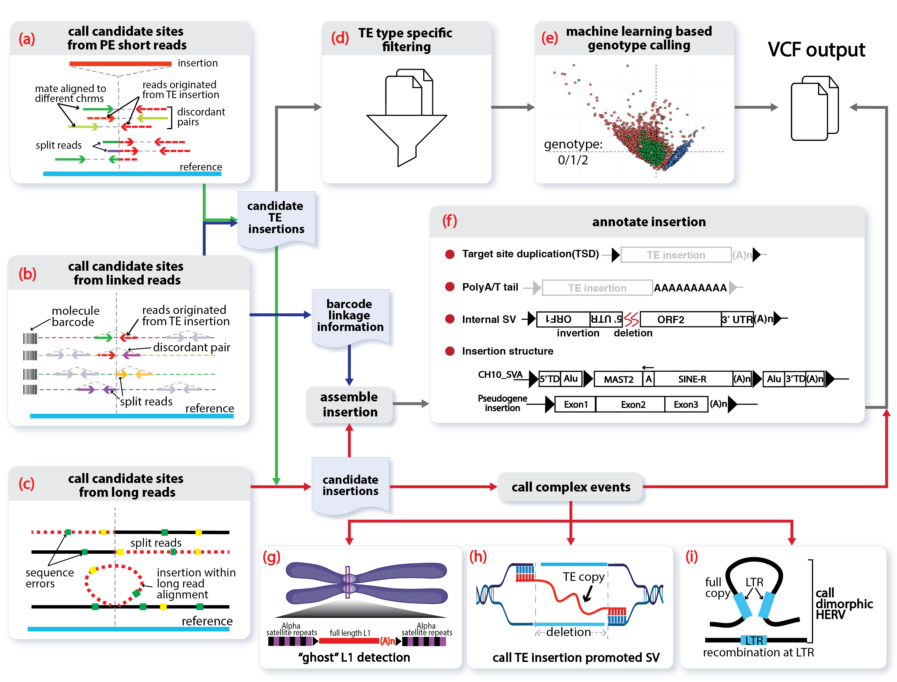

## xTea

xTea (comprehensive Transposable element analyzer) is designed to identify TE insertions from paired-end Illumina reads, barcode Linked-Reads, long reads (PacBio or Nanopore), or hybrid data (WGS/WES). 




## Download

1. long reads (PacBio or Nanopore, branch to be merged: xTea_long_release_v0.1.0)

	```
	git clone --single-branch --branch xTea_long_release_v0.1.0 https://github.com/parklab/xTea.git
	```
2. pre-processed repeat library used by xTea   
	The file size is large, and please use git lfs (https://git-lfs.github.com/)  
	```
	git lfs get 
	```
	Or directly download through `wget https://github.com/parklab/xTea/raw/master/rep_lib_annotation.tar.gz`. 
3. Gene annotation file are downloaded from GENCODE (https://www.gencodegenes.org/human/release_33.html)


## Dependency

1. bwa (version **0.7.17** or later, require the **-o** option), which can be downloaded from https://github.com/lh3/bwa.
2. samtools (v1.0 or later), which can be downloaded from https://github.com/samtools.
3. minimap2 (for long reads only), which can be downloaded from https://github.com/lh3/minimap2.
4. wtdbg2 (for long reads only), which can be downloaded from https://github.com/ruanjue/wtdbg2.
5. Python 2.7+/3.6+ 
	+ pysam (https://github.com/pysam-developers/pysam, v0.12 or later) is required to be installed.
		+ Install pysam:

			```
			conda config --add channels r
			conda config --add channels bioconda
			conda install pysam -y
			```
	+ sortedcontainers
		+ Install sortedcontainers
		`conda install sortedcontainers -y`

4. Note: bwa, minimap2, wtdbg2 and samtools need to be added to the $PATH.

## Install

1. **Use Conda**
	```
	conda install xtea
	```
2. **Install free**
	```
	git clone --single-branch --branch xTea_long_release_v0.1.0 https://github.com/parklab/xTea.git
	```

## Run xTea
1. **Input**
	+ A sample id file, e.g. a file named `sample_id.txt` with content:
	
		```
		CHM13
		HG002
		```
	+ A bam/cram file list (whose bam/cram are sorted and indexed), e.g. a file named `sample_bams.txt` with content:

		```
		CHM13 [abosolute-path]/CHM13_to_GRCh38.cram
		HG002 [abosolute-path]/HG002_to_GRCh38.cram
		```
	
			
2. **Run the pipeline**
	
	
	2.1 Generate the running script.	
			
	+ Run on a cluster or a single node
		+ Demo script
		
			```  
			SAMPLE_ID=sample_ids.txt  	
			BAMS=sample_bams.txt  
			WFOLDER=[replace with abosolute-path-of-working-folder]
			OUT_SCRTP=submit_jobs.sh
			TIME=60:00
			REF=[prefix-abosolute-path]/reference/hg38/GCA_000001405.15_GRCh38_no_alt_analysis_set.fna
			XTEA=[replace with abosolute-path-of-xTea-folder contain the *.py code; for example ./xTea_long_release_v0.1.0/xtea_long/]
			RMSK=[prefix-abosolute-path]/rep_lib_annotation/LINE/hg38/hg38_L1_larger2K_with_all_L1HS.out
			CNS_L1=[prefix-abosolute-path]/rep_lib_annotation/consensus/LINE1.fa
			REP_LIB=[prefix-abosolute-path]/rep_lib_annotation/
			
			python ${XTEA}"gnrt_pipeline_local_long_read_v38.py"  -i ${SAMPLE_ID} -b ${BAMS} -p ${WFOLDER} -o ${OUT_SCRTP} --xtea ${XTEA} -n 16 -m 48 -t ${TIME} -r ${REF} --rmsk ${RMSK} --cns ${CNS_L1} --rep ${REP_LIB}  --min 4000  -f 31 -y 15 --clean
			```


			
		+ Parameters:
			
			```
			Required:
				-i: samples id list file (each sample id per line);
				-b: Illumna bam/cram file list file (sorted and indexed, each file per line);
				-p: working folder, where the results and temporary files will be saved;
				-l: repeat library folder (folder contain files decompressed from "rep_lib_annotation.tar.gz";
				-r: reference genome file;
				-y: type of repeats will work on (1-L1, 2-Alu, 4-HERV, 8-SVA, 16-Mit, 64-Pseudogene; sum all selected as one value);
				-f: steps to run. (31 means run all the steps);
				--xtea: xTea full path 
				--cns: L1 consensus sequence (for ghost L1 calling);
				-o: generated running scripts under the working folder;
				
			Optional:
				-n: number of cores (by default 8, should be an integer);
				-m: maximum memory in GB (by default 25, should be an integer);
				-q: partition name for a cluster;
				-t: job running time;
				--lsf: add this option if this is for LSF system (by default slurm system);
				--fast: if set then the running will be more efficient; but the sensitivity may be sacrificed.
				
			Other parameters can be keep unchanged or adjust accordingly.
			```
		
	2.2 The previous step will generate a shell script called `run_xTea_pipeline.sh` under `WFOLDER/sample_id/L1(or other type of repeats)`, where `WFOLDER` is specified by `-p` option.
		
	+ To run on the cluster, like slurm system: `sbatch < run_xTea_pipeline.sh`
	+ To run on a single node: `sh run_xTea_pipeline.sh`
	
	
	2.3 Work on CHM13 reference genome

	+ By default, xTea assume the reference genome is hg38/GRCh38. To work on CHM13 reference genome, replace `gnrt_pipeline_local_long_read_v38.py` with `gnrt_pipeline_local_long_read_CHM13.py` in the demo script. 

	
3. **Output**

	For each TE/retroelement a result file with suffix "classified_results.txt" will be generated under the working folder.

4. **Citation and accompany scripts**
	If you are using xTea for your project, please cite:
	
	```
	Chu, C., Borges-Monroy, R., Viswanadham, V.V. et al. Comprehensive identification of transposable element insertions using multiple sequencing technologies. Nat Commun 12, 3836 (2021). https://doi.org/10.1038/s41467-021-24041-8
	```

	The accompany scripts for re-produce the results in the paper could be found here: `https://github.com/parklab/xTea_paper`

5. **Update Log**

	02/15/2025 Add support for CHM13 human reference genome.
